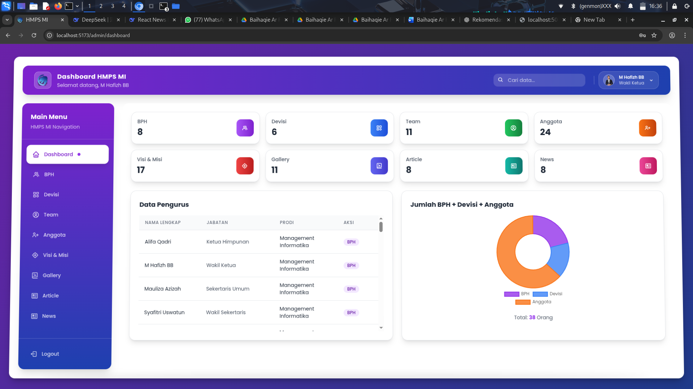
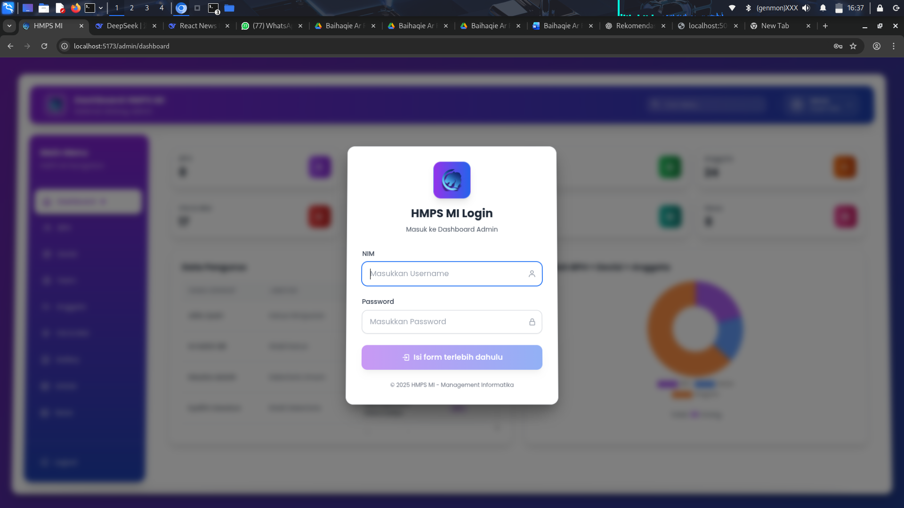
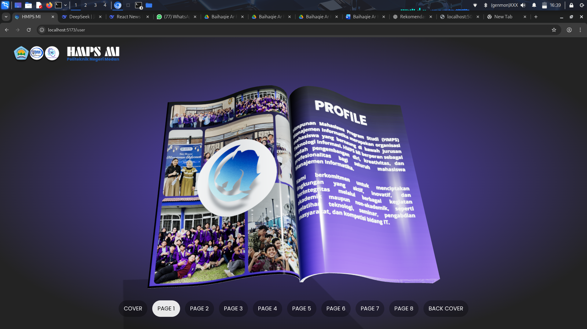

# 🌐 Baihaqie Ar Rafi - Fullstack Project (Frontend + Backend)

Project ini berisi **frontend** dan **backend** dari aplikasi yang dikembangkan menggunakan MERN Stack (MongoDB, Express, React, Node.js).

---

## 📸 Preview Website

Berikut tampilan hasil website:

  
  


---

## ⚙️ Cara Menjalankan

### 1️⃣ Jalankan Backend

```bash
cd backend
npm install
npm run dev
